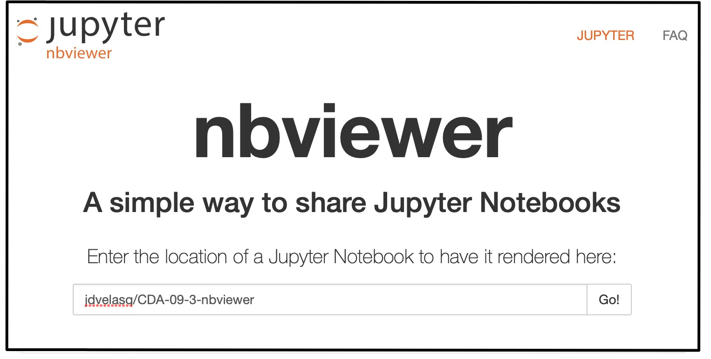
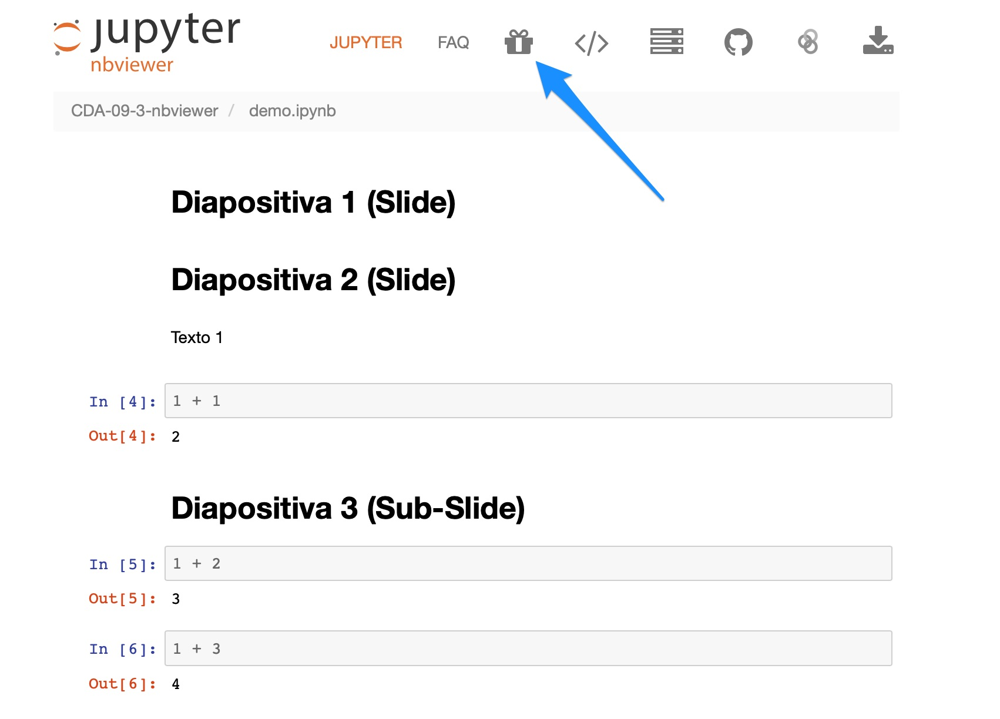
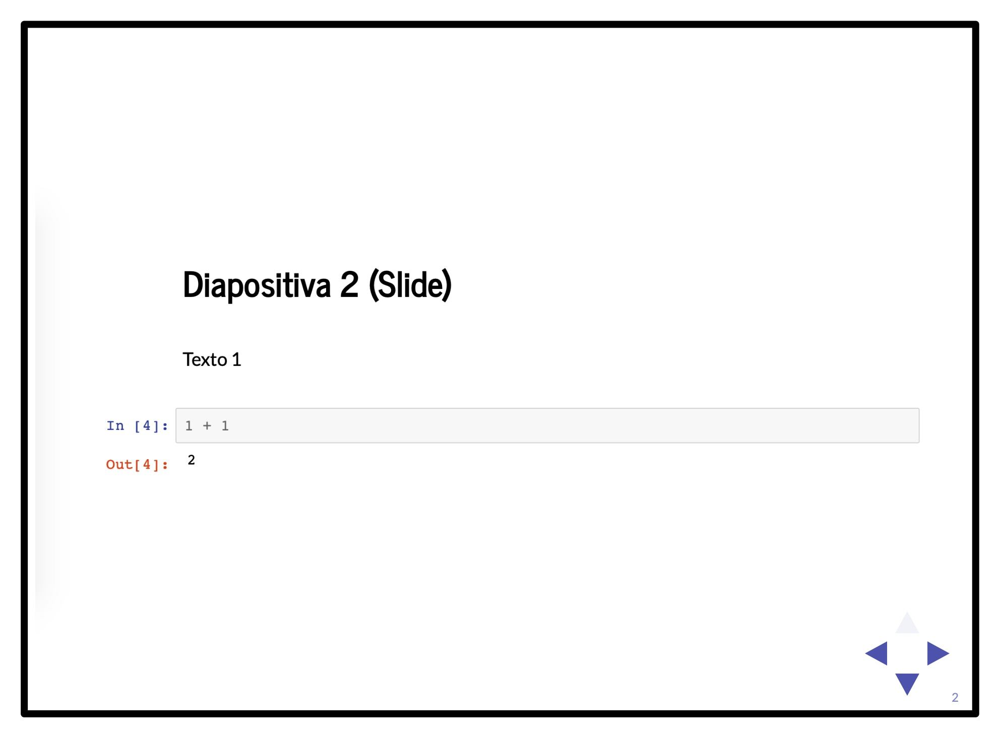

# Documentos y presentaciones en nbviewer

Este repo contiene una demostración de como realizar documentos y presentaciones usando nbviewer y GitHub.

#### Paso 1

Cree el repo en GitHub. Puede usar un repo existente.

#### Paso 2

Cree un notebook (o edite un notebook existente) usando Jupyter Notebook (Jupyter Lab no permite crear directamente presentaciones). Haga click en **View > Cell Toolbar > Slideshow**. Esto activará la barra de menús de cada celda. 

#### Paso 3

Cambie el tipo de slide para cada celda:

* Slide: crea una nueva diapositiva.

* Sub-Slide: Crea una diapositiva secundaria.

* Fragment: El contenido aparece en la diapositiva actual.

* Skip: La celda es ignorada en la presentación.

* Notes: Notas de la presentación.

#### Paso 4

Para ver la presentación en modo local, abra Terminal y digite:

    jupyter nbconvert --to slides --post serve  demo.ipynb
    
Se abrirá una ventana del explorador con su presentación. Verifiquela y haga los cambios necesarios.

#### Paso 5

Suba el repo con la presentación a GitHub. Vaya a nbviewer (http://nbviewer.jupyter.org). En la caja de texto, digite su nombre de usuario y el nombre del repo:

     jdvelasq/CDA-09-3-nbviewer
     
     
     
Se abrirá una ventana que mostrará el contenido del repo y permitirá seleccionar el libro para visualizarlo en modo documento.

Haga click [aquí](http://nbviewer.jupyter.org/github/jdvelasq/CDA-09-3-nbviewer/blob/master/demo.ipynb) para ir directamente al documento visualizado en nbviewer.

#### Paso 6

Para visualizar el libro como una presentación, haga click en el ícono del proyector.

